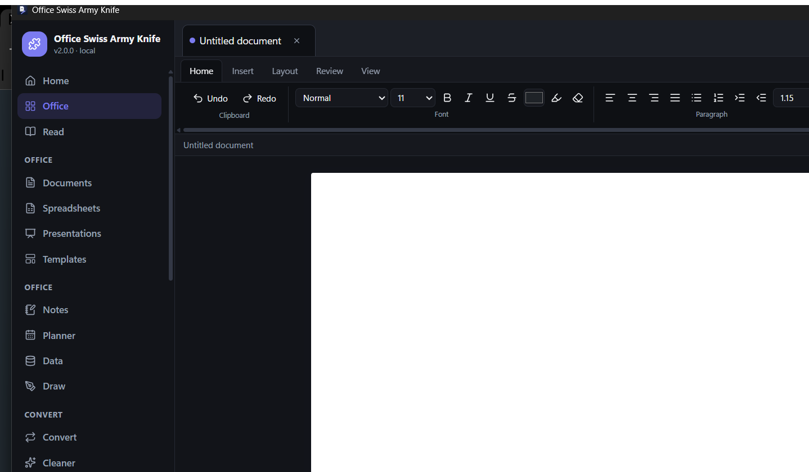
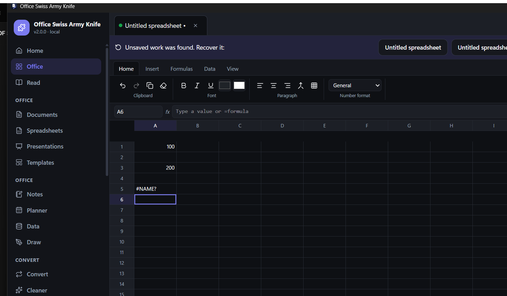
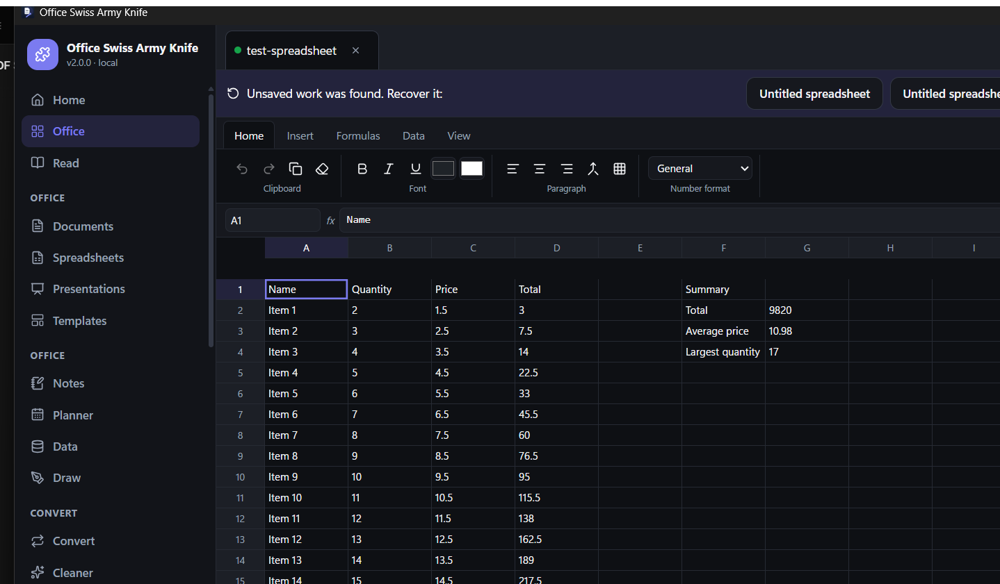
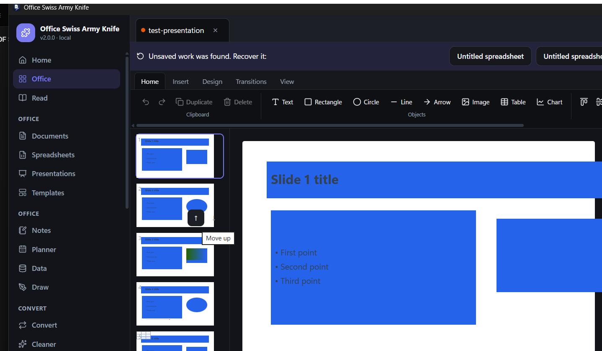

# Office Swiss Army Knife

A local-first Windows desktop productivity suite: a word processor (Writer), a
spreadsheet (Calc), a presentation editor (Impress), local productivity tools
(Notes, Planner, Data, Draw, Templates, PDF Forms) and the complete PDF toolkit
this project started from.

Everything runs on your machine. Documents are never uploaded, there is no
telemetry, and the app stays useful without an internet connection. Macros and
embedded scripts in office files are never executed.

**Version 2.0.0** · Platform: Windows (Tauri also targets Linux/macOS, but only
Windows is built and verified here) · UI languages: English, Turkish.

## Screenshots

| Writer — typing on the page | Calc — cells and formulas |
|---|---|
|  |  |

| Calc — opening a 100-row XLSX with live formulas | Impress — PPTX with slides, shapes and images |
|---|---|
|  |  |

All screenshots come from the running application (`scripts/ui-flow.ps1`
automation). The PDF module screenshots live in `docs/` from earlier releases.

## What is verified working

These workflows were exercised on the built application and with automated tests:

- **Writer**: click anywhere on the page → caret appears → typing updates the
  document model (screenshot above). Round-trip tests cover DOCX/ODT/RTF with
  headings, bold/italic/underline, bullet and numbered lists, tables, images,
  page breaks and a header/footer with real `PAGE` / `NUMPAGES` fields.
- **Calc**: click a cell → type a value → `Enter` commits and moves on; the
  formula bar edits formulas. Opening the 100-row sample XLSX computes
  `=SUM(...)`, `=AVERAGE(...)`, `=MAX(...)` and per-row `=B*C` correctly
  (screenshot above).
- **Impress**: opening the sample PPTX loads five slides with text, bullets,
  images, shapes, a table, speaker notes and transitions (screenshot above).
- **PDF**: every tool from v1.x is unchanged and still covered by its tests.

## Modules

### Writer (word processor)
- DOCX, ODT, RTF, TXT, Markdown, HTML import/export · PDF export · lossless `.oswk` unit format
- Styles (Normal, Title, Subtitle, Heading 1–6, Quote, Caption, Code), fonts, sizes,
  bold/italic/underline/strikethrough, superscript/subscript, text colour, highlight
- Alignment, line spacing, space before/after, indents (including first-line and hanging)
- Bullet, numbered and multilevel lists; tables (insert, add/delete row and column, shading, borders);
  images (insert, resize, caption, alignment); hyperlinks; page breaks; horizontal rules
- Page setup: A4/A5/A3/Letter/Legal, portrait/landscape, Normal/Narrow/Wide/custom margins, columns
- Headers and footers with automatic `{{page}}` / `{{pages}}` numbers (written as real fields in DOCX)
- Find & replace (case sensitive, whole word), comments sidebar, word/character/page count,
  zoom, print, export PDF with selectable text

### Calc (spreadsheet)
- XLSX, ODS, CSV/TSV import/export · XLS import (read-only) · PDF export
- Virtualised grid, name box and formula bar, multi-sheet workbooks (add, rename, delete)
- Formula engine with ~70 functions: SUM, AVERAGE, MIN, MAX, COUNT, COUNTA, COUNTBLANK, MEDIAN,
  STDEV, IF, IFS, IFERROR, AND, OR, NOT, ROUND/ROUNDUP/ROUNDDOWN, ABS, PRODUCT, SQRT, POWER, MOD,
  INT, CEILING, FLOOR, SUMIF(S), COUNTIF(S), AVERAGEIF, VLOOKUP, HLOOKUP, XLOOKUP, INDEX, MATCH,
  CONCAT, TEXTJOIN, LEFT, RIGHT, MID, LEN, TRIM, UPPER, LOWER, PROPER, SUBSTITUTE, REPT, TEXT,
  VALUE, TODAY, NOW, DATE, YEAR, MONTH, DAY, HOUR, MINUTE, LARGE, SMALL, RANK, SUMPRODUCT,
  ISNUMBER, ISTEXT, ISBLANK, ISERROR, PI, RAND, RANDBETWEEN
  (cross-sheet references such as `=SUM(Data!D2:D101)` work)
- Explicit errors instead of silent wrong answers: `#NAME?`, `#VALUE!`, `#REF!`, `#DIV/0!`, `#N/A`, `#NUM!`
  and circular-reference detection
- Cell formatting (font, colour, fill, borders, alignment, wrap), number formats
  (General, Number, Currency, Percentage, Date, Time, Accounting), sorting, filtering,
  freeze panes, conditional formatting (greater/less/between/equal/text/duplicates/top-N/data bars),
  data validation (list and number range), row/column insert, delete and resize
- SVG charts fed from cell ranges (column, bar, line, pie, area) that refresh with the data

### Impress (presentations)
- PPTX and ODP import/export · PDF export · lossless `.oswk`
- Slide thumbnails with reorder, canvas with drag/resize/rotate, z-order, align, group/ungroup
- Text, image, rectangle, rounded rectangle, circle, line, arrow, table, chart objects
- Eight layouts, six original themes, transitions (fade, slide, push, wipe), full-screen slideshow,
  speaker notes

### Productivity tools
- **Notes** (folders, tags, search, pin, favourite, archive) · **Planner** (month view, tasks,
  priorities, deadlines) · **Data** (local tables with CSV/JSON import/export) ·
  **Draw** (shapes, lines, arrows, text, freehand; SVG/PNG/PDF export) ·
  **Templates** (24 original documents, spreadsheets and decks) ·
  **Converter** (batch office conversions with honest unsupported-target messages) ·
  **Document Cleaner** (metadata/comments removal, embedded image optimisation) ·
  **PDF Forms** (standard AcroForm text, checkbox, radio and dropdown fields)

### PDF module (unchanged from v1.x)
Reader with search, Merge, Split, Organize, Compress, OCR (Tesseract), Protect (AES-256),
Unlock, Watermark, Annotate, Metadata, Page tools (extract/delete/rotate/resize/crop/numbering),
PDF → JPG/PNG, JPG/PNG → PDF, Batch processing, Info, optional offline AI assistant.

### Workspace
- Document tabs for Writer/Calc/Impress, dirty indicators
- Autosave (15 s / 30 s / 1 min / 5 min / off) with crash recovery and a recovery banner
- Local version history (up to 25 snapshots per document)
- Favourites and pinned files, Light/Dark/System/Midnight/Paper themes
- Open documents from the toolbar, `Ctrl+O`, drag & drop, recent files, or Windows
  file associations (double-click)

## Supported formats

Only combinations that actually work are marked. “–” means not supported.

| Format | Open | Edit | Save | PDF export |
|---|---|---|---|---|
| DOCX | ✓ | ✓ | ✓ | ✓ |
| DOC | – | – | – | – |
| ODT | ✓ | ✓ | ✓ | ✓ |
| RTF | ✓ | ✓ | ✓ (basic formatting, tables, images) | ✓ |
| TXT / Markdown / HTML | ✓ | ✓ | ✓ | ✓ (via Writer) |
| XLSX | ✓ | ✓ | ✓ | ✓ |
| XLS | ✓ | – | – | – |
| ODS | ✓ | ✓ | ✓ | ✓ |
| CSV / TSV | ✓ | ✓ | ✓ | – |
| PPTX | ✓ | ✓ | ✓ | ✓ |
| PPT | – | – | – | – |
| ODP | ✓ | ✓ | ✓ | ✓ |
| PDF | ✓ | ✓ (existing tools) | ✓ | – |
| JPG / PNG / BMP / GIF / WebP | ✓ | ✓ (as images) | ✓ | ✓ (images → PDF) |
| SVG | ✓ (inserted as image) | ✓ | ✓ (media in DOCX/ODT) | ✗ (not rasterised) |
| `.oswk` unit | ✓ | ✓ | ✓ | ✓ |

## Sample documents

`samples/` contains documents generated by the suite itself (no personal data):
`test-document.docx`, `test-document.odt`, `test-document.rtf`,
`test-spreadsheet.xlsx`, `test-spreadsheet.ods`, `test-spreadsheet.csv`,
`test-presentation.pptx`, `test-presentation.odp`.

Regenerate them with:

```bash
cargo run -p officecore --example make-office-samples
```

## Architecture

```
crates/officecore   Document model + DOCX/ODT/ODS/ODP/RTF/XLSX/CSV/PPTX engines,
                    hardened ZIP (ZIP-bomb limits) and XML layers, PDF layout and
                    rendering with an embedded OFL font, document cleaner
crates/pdfcore      The original PDF engine (render, merge, split, compress, OCR,
                    security, watermark, annotations, metadata, page layout)
crates/aicore       Optional assistant client, only used after the user opts in
src-tauri           Tauri shell: PDF commands (untouched) + office commands,
                    JSON stores, version history, recovery, file associations
src/                React 19 + TypeScript + Tailwind 4 frontend
  src/office        Writer, Calc (with the formula engine), Impress, tool screens
  src/screens       Original PDF screens (kept working)
```

The document model (`crates/officecore/src/model.rs`) is the single source of truth
shared by the Rust engines and the TypeScript editors. File formats are import/export
targets; the native `.oswk` format preserves everything the suite understands,
including features a given file format cannot represent.

## Build

Requirements: Node.js 20+, Rust 1.82+, Visual Studio Build Tools (Windows).

```bash
npm install
npm run engines:fetch      # pdfium, qpdf, tesseract and fonts (skipped if present)
npm run build              # type-check + frontend production build
npm run test:rust          # cargo test --workspace
npm run app:build          # Tauri release build (first run downloads NSIS)
npm run package            # NSIS installer + portable ZIP into release-artifacts/
```

Development: `npm run app:dev`.

## Tests

```bash
cargo test --workspace
```

- `officecore`: 62 unit tests (model, ZIP limits, XML, DOCX/ODT/ODS/ODP/RTF/XLSX/CSV/PPTX,
  PDF layout, cleaner) + 8 round-trip tests against the sample documents
- `pdfcore`: 62 unit tests + 50 integration tests (unchanged)
- `aicore`: 18 tests · `src-tauri`: 10 tests
- The frontend is type-checked with strict TypeScript (`npm run build`); a browser
  test suite for the Chrome extension lives in `chrome-extension/`.

## Privacy and security

- No cloud upload, no telemetry, no document content collection, no mandatory account.
- Only `aicore` performs network requests, and only after the user explicitly enables the assistant.
- Macros and embedded scripts are never executed; documents always open with macros disabled.
- ZIP extraction is bounded (entry count, size, compression ratio) to resist ZIP bombs.
- XML parsing is depth-limited and does not expand external entities.
- Writes are atomic (temp sibling + rename); passwords are never logged or persisted.
- Recovery snapshots and version history stay in the app data directory on your machine.

## Known limitations

- Writer uses a continuous page view with page-break markers; page setup, headers,
  footers, print and the exported PDF are page-accurate, but the on-screen canvas is not
  a full WYSIWYG pager.
- After committing a cell with `Enter`, continuing to type without clicking the next cell
  is not yet fully reliable; clicking the target cell always works. Fixing this race is the
  next editor task.
- XLSX export keeps values, formulas, styles, number formats, merges, column widths, row
  heights, freeze panes, data validation and gridline settings, but does not embed charts or
  conditional-formatting rules (they are kept in `.oswk`). Comments in imported files are not read.
- PPTX export does not embed charts; animations, SmartArt and grouped shapes are not imported.
- DOCX import simplifies text boxes, SmartArt, equations, tracked changes and non page-number
  fields, and reports each case in the import warnings shown after opening.
- SVG images are stored as media but cannot be rasterised into exported PDFs.
- XLS files can be opened but not saved back to XLS (use XLSX/ODS/CSV).
- Interoperability with Microsoft Office/LibreOffice was validated structurally (package parts,
  content types, relationships) rather than by launching those applications.
- macOS/Linux builds are not produced here.

## Roadmap

- Reliable consecutive keyboard entry in Calc (focus after commit) and a full audit of the
  remaining automation-visible issues
- True paginated Writer canvas with live layout
- XLSX chart and conditional-formatting export; PPTX chart import/export
- Frontend unit tests (vitest) for the formula engine and model helpers
- Optional AI assistant actions for office documents (summarise, rewrite, suggest formulas)

## License

MIT. See [LICENSE](LICENSE). Third-party components keep their own licenses
(Tauri, React, Tailwind, lopdf, pdfium, qpdf, Tesseract, PT Sans/OFL, …).
